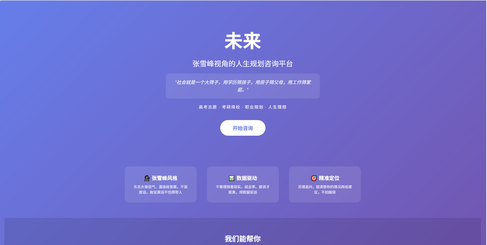

# 未来 - 张雪峰视角人生规划咨询平台

> 基于 AI 的高考志愿、考研择校、职业规划咨询平台

## 网站截图



## 项目介绍

"未来"是一款基于张雪峰视角的人生规划咨询平台，提供高考志愿、考研择校、职业规划等服务。

**核心理念**：用数据说话，敢说真话，不怕得罪人。

**核心功能**：
- 🎓 高考志愿咨询
- 📚 考研择校指导
- 💼 职业规划建议
- 🌟 人生理想探讨

## 技术栈

| 层级 | 技术 |
|------|------|
| 前端 | Vue 3 + Vite |
| 后端 | Python + FastAPI |
| AI | MiniMax API (OpenAI 兼容) |
| AI Role | zhangxuefeng-skill |

## 目录结构

```
TheFuture/
├── backend/                     # Python FastAPI 后端
│   ├── zhangxuefeng-skill/    # 张雪峰角色 Skill
│   ├── app/
│   │   ├── main.py            # FastAPI 入口
│   │   ├── api/chat.py        # 对话 API
│   │   ├── core/config.py     # 配置
│   │   └── services/ai_service.py  # AI 服务
│   ├── Dockerfile
│   └── requirements.txt
├── frontend/                    # Vue 3 前端
│   ├── src/
│   │   ├── views/Home.vue     # 首页
│   │   ├── views/Consult.vue  # 咨询页
│   │   └── router/index.js    # 路由
│   ├── Dockerfile
│   └── nginx.conf
├── docker-compose.yml           # Docker 编排
└── README.md
```

## 感谢

本项目的 AI 角色设计基于 **[zhangxuefeng-skill](https://github.com/alchaincyf/zhangxuefeng-skill.git)** 项目，感谢作者 [@alchaincyf](https://github.com/alchaincyf) 的精心设计和开源分享。

zhangxuefeng-skill 基于张雪峰老师的公开言论、著作和采访，提炼出5个核心心智模型、8条决策启发式和完整的表达DNA，使得 AI 能够以张雪峰的风格进行咨询对话。

## 安装部署

### 环境要求

- Python 3.10+
- Node.js 18+
- npm 或 yarn
- Docker & Docker Compose（可选）

### 方式一：本地开发

#### 1. 克隆项目

```bash
git clone <repository-url>
cd TheFuture
```

#### 2. 克隆 zhangxuefeng-skill

```bash
cd backend
git clone https://github.com/alchaincyf/zhangxuefeng-skill.git
```

#### 3. 配置后端

```bash
cd backend

# 复制配置模板
copy .env.example .env

# 编辑 .env 文件，填入你的 API Key
# MINIMAX_API_KEY=your-api-key-here
# MINIMAX_BASE_URL=https://api.minimax.chat/v
# MODEL_NAME=your-model-name
# AI_SDK_TYPE=openai  # 或 anthropic
```

#### 4. 安装后端依赖

```bash
cd backend
pip install -r requirements.txt
```

#### 5. 启动后端服务

```bash
cd backend
PYTHONIOENCODING=utf-8 python -m uvicorn app.main:app --host 0.0.0.0 --port 8000
```

后端服务运行在：http://localhost:8000

#### 6. 安装前端依赖

```bash
cd frontend
npm install
```

#### 7. 启动前端服务

```bash
cd frontend
npm run dev
```

前端服务运行在：http://localhost:5173

#### 8. 访问测试

打开浏览器访问 http://localhost:5173 即可使用。

---

### 方式二：Docker 部署

#### 1. 克隆项目

```bash
git clone <repository-url>
cd TheFuture
```

#### 2. 配置环境变量

```bash
cd backend
copy .env.example .env

# 编辑 .env 文件，填入你的 API Key
```

#### 3. 构建并启动

```bash
docker-compose up --build -d
```

#### 4. 访问服务

- 前端：http://localhost:80
- 后端 API：http://localhost:8000
- API 文档：http://localhost:8000/docs

---

### 方式三：云服务器部署

#### 1. 服务器准备

- 安装 Docker 和 Docker Compose
- 配置防火墙开放 80 端口

#### 2. 上传代码

```bash
# 在服务器上克隆或上传项目
cd TheFuture
```

#### 3. 配置环境变量

```bash
cd backend
vim .env
# 填入生产环境的 API Key
```

#### 4. 修改 CORS 配置（生产环境）

编辑 `backend/app/core/config.py`，将 `CORS_ORIGINS` 中的 `*` 替换为你的域名：

```python
CORS_ORIGINS = [
    "https://your-domain.com",  # 你的域名
]
```

#### 5. 构建并启动

```bash
docker-compose -f docker-compose.yml up -d --build
```

#### 6. 配置 Nginx 反向代理（可选）

如果你有域名，可以配置 Nginx 反向代理到 80 端口，并配置 SSL 证书。

---

## API 接口

### 健康检查

```bash
GET /api/health
```

### 对话咨询

```bash
POST /api/chat
Content-Type: application/json

{
  "message": "你问题",
  "history": []
}
```

响应：SSE 流式输出

### 重置对话

```bash
POST /api/reset
```

---

## 开发说明

### 后端 API 文档

启动后端后，访问：http://localhost:8000/docs

### 前端开发

```bash
cd frontend
npm run dev    # 开发模式
npm run build  # 生产构建
```

### 调试 AI 输出

如果 AI 输出包含 `[TOOL_CALL]` 等调试信息，可以检查 `backend/app/services/ai_service.py` 中的 `clean_tool_calls` 函数。

---

## 注意事项

1. **API Key 安全**：不要将 `.env` 文件提交到代码仓库
2. **CORS 配置**：生产环境请限制具体的域名
3. **编码问题**：Windows 下请使用 `PYTHONIOENCODING=utf-8` 环境变量

---

## License

MIT
